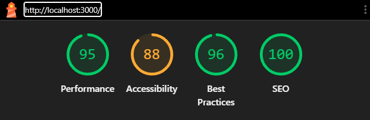

## Стек технологий

**Next.js** (App Router) + **TypeScript**
**Redux Toolkit**
**SCSS Modules** ( стили остаются обычным CSS, а изоляция достигается без JavaScript-рантайма)
Адаптивная вёрстка mobile-first

## Инструкция по запуску

Проверить в консоли "node -v" ("^20")

Скачиваем проект открываем консоль "npm install" устанавливаем зависимости

Запуск проекта "npm start"

## Обратная связь

## Demo-version
